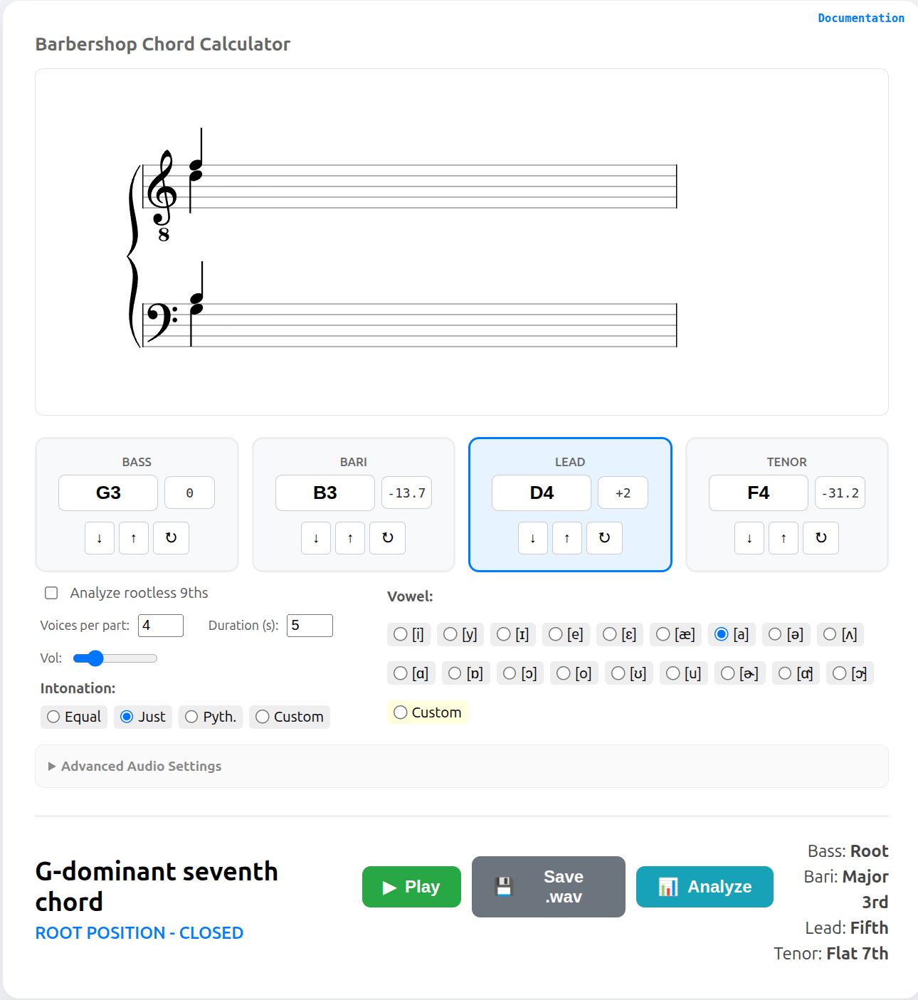
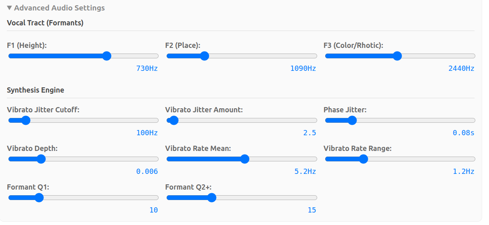

# Barbershop Chord Calculator
A specialized music theory tool for barbershop quartet singers and arrangers. Enter four notes to identify the chord and the functional role of each voice part.  Optionally play the chord, save it to a file, or analyze its spectrum.

The tool is currently tuned for **TTBB barbershop harmony**, following standard quartet engraving conventions:
* **Tenor & Lead:** Treble Clef (8vb) — Stems Up (Tenor), Stems Down (Lead).
* **Bari & Bass:** Bass Clef — Stems Up (Bari), Stems Down (Bass).

If you want to use it for SSAA or SATB, you could just pretend it's TTBB; the chord and role identification are the same except that open versus closed voicing might be different if you're using it for SATB.  (Playback, of course, will be different.)  If there is enough demand I will consider adding options for SATB or SSAA.  Or you are welcome to submit a pull request.



## License
This application and its source code are released under the [MIT License](https://github.com/trovatore/BarbershopChordCalculator/blob/main/LICENSE).  There is no warranty of any kind, express or implied.

## Using the App
  * Select a Part: Click on a voice box (Bass, Bari, Lead, or Tenor) or use Right Arrow and Left Arrow to cycle through them.  The Tab and Shift-Tab keys will step through controls.
  * Typing Notes: When a part is selected, simply type the letter (A-G) to change the note, possibly followed by an accidental (#, b, x, or bb), and then an octave number.
  * Adjusting Custom Intonation: When a part is selected, typing a numeric value will adjust the pitch of the voice by that number of cents, and set the intonation type to "Custom".
  * Adjusting Voices per Part:  By default the tool will simulate a "very large quartet" (VLQ) with 4 voices per part.  This smooths out certain artifacts in the sound that make the chord sound "too buzzy".  You can adjust this value in the "Voices per Part" box.
  * Adjusting Chord Duration: You can change the duration of the chord in the Duration box.
  * Adjusting Volume:  Use the Vol slider.
  * Selecting Intonation: The radio buttons for "Intonation:" allow you to choose between equal temperament, just intonation, Pythagorean tuning, or a custom tuning where you specify the difference from equal temperament for each voice.
  * Selecting a Vowel: The radio buttons under "Playback Vowel:" allow you to choose the vowel by its IPA symbol.  Note that these are not necessarily perfect.  Feel free to let me know if you think a vowel sounds egregiously different from what you expected.
### Advanced Audio Settings

  * Custom Vowels:  You can move the three "Formants" sliders in the "Vocal Tract" section to
  get fine control over the vowel.  This will automatically change the vowel choice to "Custom".
  * Synthesis Engine:  Here you have a bunch of knobs you can adjust
  if you want to change the vibrato or tweak the vowels even more.  The vibrato jitter, phase jitter, and vibrato controls can sometimes help if the chord sounds too "buzzsaw-like".  I'm not going to go into details on what they mean here, partly because I'm not really sure they're going to stick around in future versions.  Take a look at [this file](https://github.com/trovatore/BarbershopChordCalculator/blob/main/static/js/audio.js) if you're interested.

## Chord and Role Identification
  * The chord name and the roles of each voice in the chord will update whenever a note is changed or respelled.  (Note however that if you are using the tool on the web with the backend running remotely, you may have to wait for the backend to spin up, and some displays might be incorrect during this time.)

## Chord Generation
  * Playback:  Press the "Play" arrow to hear the chord immediately.
  * Saving:  Press the "Save .wav" button to save the chord as a 4-channel `.wav` file.
  * Analysis:  Press the "Analyze" button to generate a spectrogram of the chord, broken down by voice part.
> [NOTE:] There is an element of randomness in chord generation, specifically regarding the vibrato and start-time jitter of each voice.  Therefore the chord will not be identical on each playback, save, or analysis, and the chord you save may not be identical to the one you play back or analyze.  This randomness can be reduced, but not eliminated, by increasing the number of voices per part.


### Note Notation
  * Accidentals: Use b for flat, # for sharp, bb for double-flat, and x for double-sharp.
  * Octaves: Follow the letter with an octave number (e.g., G3, Bb3, Cx4).
  * Enharmonics: Click the Circular Arrow (↻) or press Enter to cycle through enharmonic spellings (e.g., changing a G# to an Ab).

## Installation
(This applies if you want to use the application from the source code.  If you are running the application on a hosted web platform you can ignore this section.)

### Prerequisites
You need **Python 3.10 or higher** installed on your computer.

### 1. Clone and Setup
1. Open your terminal (or Command Prompt/PowerShell on Windows) and run:

```bash
git clone https://github.com/trovatore/BarbershopChordCalculator.git
cd BarbershopChordCalculator
```
2. Create a Virtual Environment

  * In Linux / macOS:
```bash
python3 -m venv .venv
source .venv/bin/activate
```
  * In Windows:
```Powershell
python -m venv .venv
.venv\Scripts\activate
```
3. Install Dependencies
```
pip install -r requirements.txt
```

4. Run the App
```
python app.py
```
Once running, open your browser to: http://127.0.0.1:5001

## Development & Testing
To run the automated test suite and verify the music theory logic:
```
python -m unittest discover tests
```

To run the browser unit tests, with the app running, navagate to http://127.0.0.1:5001/tests/js.

## Contributing
Feedback and contributions are welcome!
For bugs, pain points during installation, or feature requests, please visit [the GitHub page for the project](https://github.com/trovatore/BarbershopChordCalculator), where you can open an Issue or join the Discussions.
Pull requests are encouraged.

